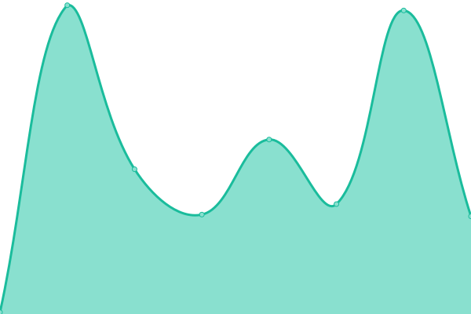

# [📈 Live Status](https://status.wpsevac.com): <!--live status--> **🟩 All systems operational**

This repository contains the open-source uptime monitor and status page for [WPS Disaster Management Solutions](https://wpsevac.com/), powered by [Upptime](https://github.com/upptime/upptime).

With [Upptime](https://upptime.js.org), you can get your own unlimited and free uptime monitor and status page, powered entirely by a GitHub repository. We use [Issues](https://github.com/WPSDisaster/upptime/issues) as incident reports, [Actions](https://github.com/WPSDisaster/upptime/actions) as uptime monitors, and [Pages](https://status.wpsevac.com) for the status page.

<!--start: status pages-->
<!-- This summary is generated by Upptime (https://github.com/upptime/upptime) -->
<!-- Do not edit this manually, your changes will be overwritten -->
<!-- prettier-ignore -->
| URL | Status | History | Response Time | Uptime |
| --- | ------ | ------- | ------------- | ------ |
|  [App](https://app.wpsevac.com/health-check) | 🟩 Up | [app.yml](https://github.com/WPSDisaster/upptime/commits/HEAD/history/app.yml) | 

 171ms
     
 | 

<a href="https://status.wpsevac.com/history/app">100.00%</a>
    

|  [CDN](https://files-staging.wpsevac.com/images/facilities/W-1001/fac-1585692711-W-1001/1585692711hi-rise-pic.jpg) | 🟩 Up | [cdn.yml](https://github.com/WPSDisaster/upptime/commits/HEAD/history/cdn.yml) | 

 196ms
     
 | 

<a href="https://status.wpsevac.com/history/cdn">100.00%</a>
    

|  [wpsevac.com](https://wpsevac.com) | 🟩 Up | [wpsevac-com.yml](https://github.com/WPSDisaster/upptime/commits/HEAD/history/wpsevac-com.yml) | 

 303ms
     
 | 

<a href="https://status.wpsevac.com/history/wpsevac-com">100.00%</a>
    

<!--end: status pages-->

[**Visit our status website →**](https://status.wpsevac.com)

## 📄 License

- Powered by: [Upptime](https://github.com/upptime/upptime)
- Code: [MIT](./LICENSE) © [Anand Chowdhary](https://anandchowdhary.com), supported by [Pabio](https://pabio.com)
- Data in the `./history` directory: [Open Database License](https://opendatacommons.org/licenses/odbl/1-0/)
